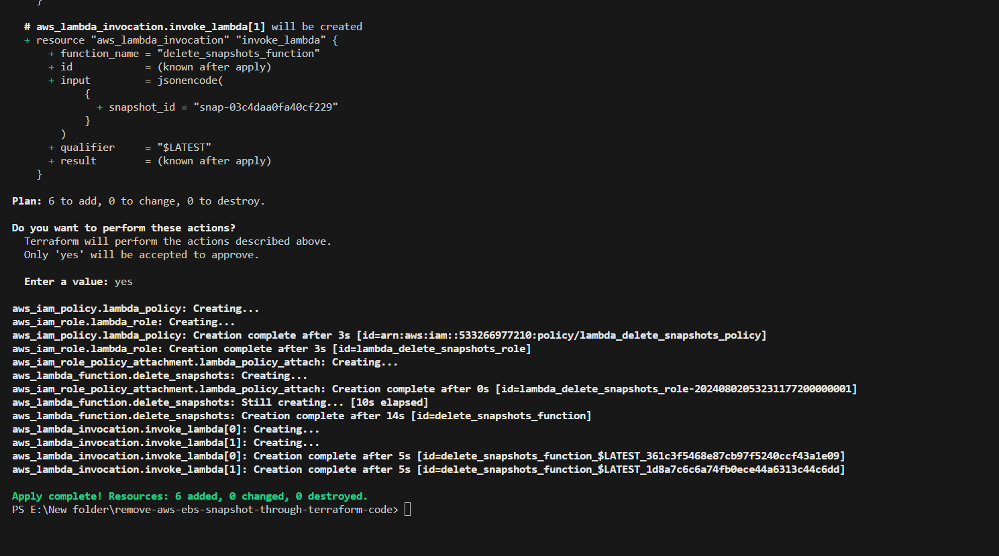

# Remove-aws-ebs-snapshot-through-terraform-code

<details><summary># Terraform will perform the following actions:</summary>
<p>

```BASH
Terraform will perform the following actions
```
- aws_iam_policy.lambda_policy will be created
- aws_iam_role.lambda_role will be created
- aws_iam_role_policy_attachment.lambda_policy_attach will be created
- aws_lambda_function.delete_snapshots will be created
- aws_lambda_invocation.invoke_lambda[0] will be created
- aws_lambda_invocation.invoke_lambda[1] will be created  
</p>

</details>


# Plan: 6 to add, 0 to change, 0 to destroy.
```
terraform init
terraform validate
terraform plan
terraform apply -auto-approve
```

```
terraform destroy -auto-approve
```
##


##


##
🙂 If you find this code useful please give it a 🌟 and check back for updates! 
